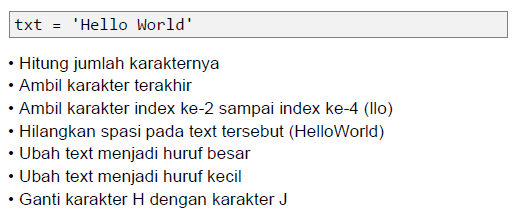
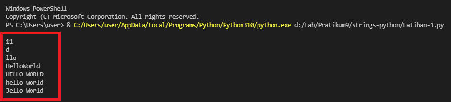
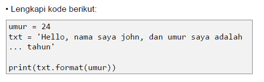
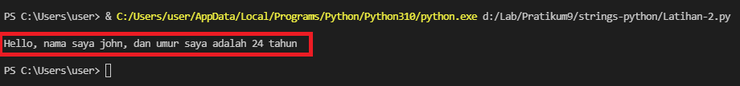

# Python String

* String adalah jenis yang paling populer di Python. 
* Untuk membuatnya hanya dengan melampirkan karakter dalam tanda kutip. 
* Python memperlakukan tanda kutip tunggal ('') sama dengan tanda kutip ganda (""). 
* Membuat string semudah memberi nilai pada sebuah variabel.

## Latihan 1



## Penjelasan

* Untuk menghitung jumlah karakter, gunakan fungsi `len()`. 

```python
	print(len(txt))
```

* Untuk mengambil karakter terakhir, gunakan index [-1]. Sedangkan untuk mengambil karakter index ke-2 sampai ke-4, gunakan index [2:5].

```python
	print(txt[-1]) #Mengambil karakter terakhir
	print(txt[2:5]) #Mengambil karakter index ke-2 sampai ke-4	
```

* Jika ingin menghilangkan spasi pada string, gunakan fungsi `replace()`.

```python
	print(txt.replace(" ", ""))
```

* Untuk mengubah huruf menjadi besar, gunakan fungsi `upper()`. Sedangkan jika ingin mengubah huruf menjadi kecil, gunakan fungsi `lower()`.

```python
	print(txt.upper()) #Mengubah huruf menjadi besar
	print(txt.lower()) #Mengubah huruf menjadi kecil
```

* Untuk mengganti karakter ‘H’ dengan karakter ‘J’, gunakan fungsi `replace()`.

```python
	print(txt.replace("H", "J"))
```
## Output Program



## Latihan 2



## Penjelasan

Untuk memasukkan variable ke dalam string, tambahkan kurung kurawal {} untuk menempatkan variable sebelumnya.

```python
    umur = 24
    txt = "\nHello, nama saya john, dan umur saya adalah {0} tahun\n"
    print(txt.format(umur))
```

## Output Program



## Sekian Terimakasih